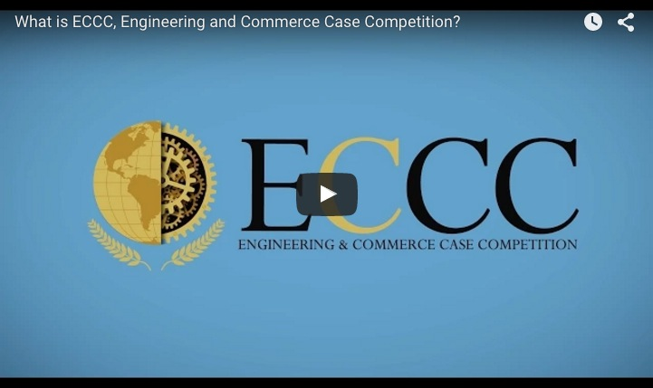

### CRUSHING THE BARRIERS BETWEEN ENGINEERS AND BUSINESS STUDENTS
This video in a sense sums up what we are trying to achieve with this hackathon: 
**please click the image to watch**

####GOAL
How do we engage Business students and Engineers to work collaboratively to build something of commercial value.

To bridge the disciplinary divide between engineering and business

 **NOT**

####HOW
Like a coach a business student should help the team find the right direction, to identify solutions and brainstorm. 

What we need Business Students to do is to identify problems, develop ideas through entrepreneurial instinct, gather the right people for the job, do project management, build a business plan and communicate its viability in the market. 

Whereas the engineers will be the ones bringing the ideas of the business student to life. They will start with a blank piece of paper and develop a new device, website or app that will solve the problem the business student has identified. 

**Start**

+ Find a team
+ Develop a solution to a problem

**During**

+ Delegate tasks and deadline’s (project management) 
+ Create business model canvas
+ Generate ideas such as uses, capitalization, commercialization, partnerships

**End**

+ Focus on pitch and video, story telling
+	Create demo presentation

####The Judging Criteria 
that we want business students to focus on:

**Potential Impact**
Will users get excited about this, is it applicable, does it solve a genuine problem?

The “Potential Impact” and “Business readiness” of the creations will be an important aspect to this and we need the business students to ensure that the technology excels in these criteria’s. 

‘It’s about focusing your technology to address problems you’ve identified in a market. The earlier you do that the less time you’ll waste later on going back to redo things.’ 

####Ideas!?
How to do we get them to work together collaboratively? 

+ Requiring each team to have 1 comm student and setting expectations of what they are supposed to do 
+	Having mentor/coaches 
+	Using only entrepreneurship students
+	Do business students come in with ideas already or they collaborate?

####Business Student Guide
Create a business starter kit 

-  pre-print large business model canvas), Supply post-its
-	https://youtu.be/QoAOzMTLP5s (business model canvas)
-	project management guidelines and tips, agile methodology

.jpg)

###Business Hackathon?
The “Business Innovation Hackathon” combines activities from the area of “Business Innovation” in form of a “Hackathon”. In doing so, “Business Innovation” indicates the process of the development of new business models, products, and services. The concept “Hackathon” originally stems from the area of rapid software development. We transferred the speed of “hacking” and its focus on real solutions onto the business world!

**Another Great Video!**
